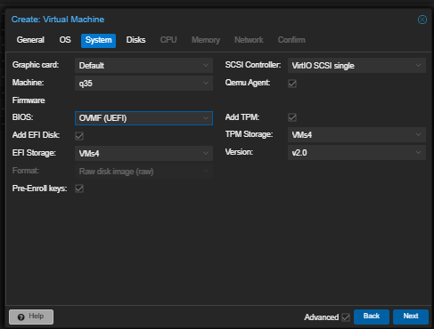

# Proxmox for FarmLabs

**Last Updated:** 20-05-2025

> ⚠️ **IMPORTANT:** This guide will NOT work for NVIDIA 30/40/50 series cards or AMD cards.

## Table of Contents
- [Introduction](#introduction)
  - [Who is this guide for?](#who-is-this-guide-for)
  - [Hardware Requirements](#hardware-requirements)
  - [What You'll Learn](#what-youll-learn)
- [1. Installing Proxmox](#1-installing-proxmox)
  - [1.1 Download and Create Installation Media](#11-download-and-create-installation-media)
  - [1.2 Install Proxmox VE](#12-install-proxmox-ve)
  - [1.3 Configure Hugepages (Optional)](#13-configure-hugepages-optional)
- [2. Setting Up vGPU Support](#2-setting-up-vgpu-support)
  - [2.1 Understanding vGPU Profiles](#21-understanding-vgpu-profiles)
  - [2.2 Configure vGPU Profile](#22-configure-vgpu-profile)
- [3. Creating a Windows VM](#3-creating-a-windows-vm)
  - [3.1 VM Configuration Steps](#31-vm-configuration-steps)
  - [3.2 Windows Installation](#32-windows-installation)
- [4. Installing VirtIO Drivers](#4-installing-virtio-drivers)
  - [4.1 Disk Driver Installation](#41-disk-driver-installation)
  - [4.2 Network Driver Installation](#42-network-driver-installation)
- [5. Setting Up the License Server](#5-setting-up-the-license-server)
  - [5.1 Installing Docker](#51-installing-docker)
  - [5.2 Creating License Server Directory](#52-creating-license-server-directory)
  - [5.3 Configuring the License Server](#53-configuring-the-license-server)
  - [5.4 Starting the License Server](#54-starting-the-license-server)
- [6. Configuring Windows VM for vGPU](#6-configuring-windows-vm-for-vgpu)
  - [6.1 Installing NVIDIA GRID Client Driver](#61-installing-nvidia-grid-client-driver)
  - [6.2 Setting Up Remote Access](#62-setting-up-remote-access)
  - [6.3 Updating VM Network Adapter](#63-updating-vm-network-adapter)
  - [6.4 Passing vGPU to VM](#64-passing-vgpu-to-vm)
- [7. Optimizing CPU Affinity (Optional)](#7-optimizing-cpu-affinity-optional)
  - [7.1 Using the CPU Affinity Script](#71-using-the-cpu-affinity-script)
- [Troubleshooting](#troubleshooting)
- [Glossary / Fancy words](#glossary)
- [Additional Resources](#additional-resources)

## Introduction

### Who is this guide for?
This guide is designed for FarmLabs users who want to set up Proxmox with vGPU support. vGPU (Virtual GPU) technology allows multiple virtual machines to share a single physical GPU. This guide is written with beginners in mind but includes all the technical details needed for a complete setup.

### Hardware Requirements
FOR PROXMOX ITSELF, CHECK FARMLABS DOCS FOR BOTS MINIMUM SPECS

- **CPU:** Any modern CPU with virtualization support (Intel VT-x or AMD-V, most modern cpus support this but if unsure check manufacturer specs)
- **RAM:** Minimum 16GB
- **Storage:** At least 50GB for Proxmox OS + 80GB per VM (minimum, 100GB recommended)
- **GPU:** NVIDIA GPU with vGPU support (NOT compatible with 30/40/50 series cards)

### What You'll Learn
By following this guide, you'll learn how to:
- Install and configure Proxmox VE
- Set up vGPU support for NVIDIA GPUs
- Create and configure Windows VMs
- Install necessary drivers
- Set up a license server for vGPU
- Optimize VM performance

## Setup Process Overview


The flowchart above shows the complete setup process. Each step builds on the previous one:
1. **Install Proxmox** - Creates the base virtualization platform
2. **Setup vGPU Support** - Enables GPU sharing between multiple VMs
3. **Create Windows VM** - Builds the virtual machine that will use the GPU
4. **Install VirtIO Drivers** - Improves virtual hardware performance
5. **Setup License Server** - Required for NVIDIA vGPU, without it your VMs performance will degrade heavily after 20 minutes of running.
6. **Configure VM for vGPU** - Connects the VM to the GPU and license server
7. **CPU Affinity Setup** - Optional performance optimization

## 1. Installing Proxmox

Proxmox VE (Virtual Environment) is the hypervisor we'll use to create and manage virtual machines.

### 1.1 Download and Create Installation Media

**Files needed:**
- Proxmox VE ISO: [Download Proxmox VE](https://www.proxmox.com/en/products/proxmox-virtual-environment/get-started)
- USB flash drive (8GB+)

**Steps:**

1. Download the Proxmox VE ISO from the link above
2. Create a bootable USB drive using Etcher (cross-platform) or dd (Linux)

   For Windows, macOS, or Linux:
   - Download [Etcher](https://www.balena.io/etcher/)
   - Insert your USB drive
   - Open Etcher, select the Proxmox ISO and your USB drive
   - Click "Flash!"

   For Linux:
   ```bash
   # Replace /dev/sdX with your USB drive and path/to/proxmox.iso with the path to your ISO
   sudo dd if=path/to/proxmox.iso of=/dev/sdX bs=4M status=progress
   ```

3. Boot your server from the USB drive (you may need to change boot order in BIOS)

### 1.2 Install Proxmox VE

Follow these steps to install Proxmox on your server:

1. Select "Install Proxmox VE (graphical)" from the boot menu
2. Accept the EULA by clicking "I agree"
3. Select the target hard disk for installation

   > 📝 **Note:** If using a single drive, limit boot partition size (50GB minimum) in the options (small button to the right of disk selection) to make space for VM storage.

4. Set your location and timezone
5. Enter a password for the root user and provide an email address
6. Configure the network settings:
   - Enter a hostname (e.g., bot1.farmlabs)
   - Enter IP address (CIDR) and gateway
   - Enter DNS server (usually the same address as your gateway)

7. Review the settings and click "Install"
8. After installation completes, remove the USB drive and reboot

**Verification:**
After rebooting, you should be able to access the Proxmox web interface by entering `https://your-ip-address:8006` in a web browser. Log in with username `root` and the password you set during installation.

### 1.3 Configure Hugepages (Optional)

Hugepages improve VM performance by reserving memory. This step is optional but recommended.

**Steps:**

1. Log in to your Proxmox server via SSH or console
   ```bash
   ssh root@your-proxmox-ip
   ```

2. Edit the GRUB configuration:
   ```bash
   nano /etc/default/grub
   ```

3. Find the line starting with `GRUB_CMDLINE_LINUX_DEFAULT` and add hugepages parameters:

   > 🔑 **Key Point:** Replace `N` with the number of 1GB hugepages you want to reserve.
   > This should be calculated based on your system memory. For example, if you have 32GB RAM
   > and want to use 24GB for VMs, set N to 24.
   
   FOR INTEL:
   ```
   GRUB_CMDLINE_LINUX_DEFAULT="quiet intel_iommu=on iommu=pt pcie_aspm=off initcall_blacklist=sysfb_init default_hugepagesz=2M hugepagesz=1G hugepages=N"
   ```
   FOR AMD:
   ```
   GRUB_CMDLINE_LINUX_DEFAULT="quiet iommu=pt pcie_aspm=off initcall_blacklist=sysfb_init default_hugepagesz=2M hugepagesz=1G hugepages=N"
   ```


5. Update GRUB and restart:
   ```bash
   update-grub
   reboot
   ```

**Verification:**
After reboot, check if hugepages are enabled:
```bash
cat /proc/meminfo | grep Huge
```

You should see output showing the configured hugepages.

**Next Step:** [2. Setting Up vGPU Support](#2-setting-up-vgpu-support)

## 2. Setting Up vGPU Support

In this section, we'll configure your Proxmox server to support NVIDIA vGPU, which allows multiple VMs to share a single physical GPU.

### 2.1 Understanding vGPU Profiles

Before configuring vGPU, it's important to understand what profiles are available for your GPU.

> 📝 **What is a vGPU profile?** A profile defines how much of the GPU's resources are allocated to each VM. Profiles are named with a prefix (like "Q" for Quadro) and a suffix indicating the amount of vRAM (e.g., Q1-1A = 1GB vRAM).

**Steps:**

1. Follow the [vGPU Proxmox Guide](https://gitlab.com/polloloco/vgpu-proxmox) for detailed installation instructions

2. After installation, check available profiles with:
   ```bash
   mdevctl types
   ```

3. Note the profile IDs that match your needs. You'll use these in the next step.

### 2.2 Configure vGPU Profile

Now we'll create a custom profile configuration to optimize performance.

**Steps:**

1. Create or edit the configuration file:
   ```bash
   nano /etc/vgpu_unlock/profile_override.toml
   ```

2. Add the following configuration (adjust as needed):
   ```toml
   [profile.nvidia-{profile id}]    # Replace {profile id} with your preferred base profile
   num_displays = 1
   vgpu_type = "NVS"                # Improves performance for Q profiles on some cards
   frl_enabled = 1                  # Framerate lock (0 = disabled), enabling can help prevent unneccesary resource usage

   display_width = 1920
   display_height = 1080
   max_pixels = 2073600             # 1920x1080

   framebuffer = 0x74000000         # 2GB vram
   framebuffer_reservation = 0xC000000  # 2GB vram
   ```

   > 💡 **Tip:** The profile ID should be replaced with one you found in the previous step, for example "[profile.nvidia-50]"

3. Save the file and restart the vGPU services:
   ```bash
   systemctl restart nvidia-vgpu-mgr.service
   ```

**Verification:**
Check if the vGPU manager is running:
```bash
systemctl status nvidia-vgpu-mgr.service
```

You should see "active (running)" in the output.

**Next Step:** [3. Creating a Windows VM](#3-creating-a-windows-vm)

## 3. Creating a Windows VM

In this section, we'll create a Windows VM that will use our vGPU.

**Files needed:**
- GhostSpectre Windows 11 ISO (available in FarmLabs documentation)
- VirtIO ISO: [Download](https://www.dropbox.com/scl/fi/kd7d86vuu6dsm972lpd48/virtio-win-0.1.266.iso?rlkey=jwhu7ha5y52dsvi70a1qbjdbs&st=xzgmcv9q&dl=0)

### 3.1 VM Configuration Steps

Follow these steps to create a new VM in Proxmox:

1. **General Settings**
   - Log in to the Proxmox web interface
   - Click "Create VM" in the top right corner
   - Enter a name for your VM (e.g., "Windows11-vGPU")
   - Set a VM ID (or leave as default)
   - Click Next

   

2. **OS Settings**
   - Select "Use CD/DVD disc image file (iso)"
   - Click "Select Storage"
   - Choose your storage location
   - Select the GhostSpectre Windows 11 ISO
   - Set Guest OS type to "Microsoft Windows"
   - Set Version to "11/2022"
   - Click Next

   

3. **System Settings**
   - Set BIOS to "OVMF (UEFI)"
   - Check "Add EFI Disk"
   - Set Machine to "q35"
   - Check "Add TPM" and set Storage to your preferred storage
   - Set SCSI Controller to "VirtIO SCSI single"
   - Click Next

   

4. **Disk Settings**
   - Set Bus/Device to "SCSI"
   - Set Disk size (recommended: 100 GB, minimum 80 GB)
   - Set Storage to your preferred storage disk
   - Click Next

   

5. **CPU Settings**
   - Set Cores (recommended: 4-8 cores)
   - Set Type to "host"
   - Click Next

   

   > 📝 **Note:** CPU configuration varies significantly between systems. If you plan to use the CPU affinity script provided in Section 7, you can use default settings here.

6. **Memory Settings**
   - Set Memory (recommended: 8-16 GB)
   - Click Next

   

7. **Network Settings**
   - Set Model to "Intel E1000"
   - Click Next

   

8. **Confirm Settings**
   - Review your settings
   - Check "Start after created"
   - Click Finish

   

### 3.2 Windows Installation

After creating the VM, you'll need to add the VirtIO ISO to install drivers during Windows setup:

1. Select your new VM in the Proxmox web interface
2. Click "Hardware"
3. Click "Add" → "CD/DVD Drive"
4. Select "Use CD/DVD disc image file (iso)"
5. Browse and select the VirtIO ISO you downloaded
6. Click "Add"
7. Start the VM if it's not already running

**Next Step:** [4. Installing VirtIO Drivers](#4-installing-virtio-drivers)

## 4. Installing VirtIO Drivers

VirtIO drivers improve performance for virtual hardware. We'll install these during the Windows setup process.

### 4.1 Disk Driver Installation

During Windows installation, you'll need to load the VirtIO disk driver to make your virtual disk visible:

1. Proceed through the Windows installation until you reach the "Where do you want to install Windows?" screen
2. You'll notice that no drives are shown. Click "Load driver"

   

3. Click "OK" when prompted to browse for drivers

   

4. Select the driver with "w11" in its path (.../w11/...) and click next:

   

5. After the driver loads, your disk should appear in the list
6. Select the disk and click "Next" to continue with Windows installation
7. Complete the Windows installation following the on-screen instructions

### 4.2 Network Driver Installation

After Windows is installed, you'll need to install the network driver:

**Files needed:**
- VirtIO Guest Tools: [Download](https://fedorapeople.org/groups/virt/virtio-win/direct-downloads/archive-virtio/virtio-win-0.1.266-1/virtio-win-guest-tools.exe)

**Steps:**

1. Download the VirtIO Guest Tools on another computer and transfer to your VM using a USB drive or shared folder
2. Run the VirtIO Guest Tools installer
3. Follow the installation wizard, accepting the default options
4. Restart the VM when prompted

**Verification:**
After restarting, your VM should have internet access. Open a web browser and try to access a website.

**Next Step:** [5. Setting Up the License Server](#5-setting-up-the-license-server)

## 5. Setting Up the License Server

In this section, you'll set up a license server that allows your virtual machines to use NVIDIA vGPU features. We'll use Docker to make this process simpler.

> 📝 **What is a license server?** The license server validates your virtual GPU usage. Without it, your VMs performance will be heavily degraded after 20 minutes of running.

### 5.1 Installing Docker

**Steps:**

1. Set up a separate machine running Ubuntu 24.04 (or any OS that supports Docker)
2. Follow the [official Docker installation guide](https://docs.docker.com/engine/install/ubuntu/) for Ubuntu 24.04
3. Make sure to install Docker Compose as well

### 5.2 Creating License Server Directory

**Steps:**

1. Create and navigate to working directory:
   ```bash
   mkdir ~/vgpu_licenser
   cd ~/vgpu_licenser
   ```

2. Download the docker-compose configuration:
   ```bash
   wget https://git.collinwebdesigns.de/oscar.krause/fastapi-dls/-/raw/main/docker-compose.yml
   ```

### 5.3 Configuring the License Server

**Steps:**

1. Edit the `docker-compose.yml` file:
   ```bash
   nano docker-compose.yml
   ```

2. Modify the following settings in the file:
   ```yaml
   version: '3.9'

   x-dls-variables: &dls-variables
     TZ: Europe/Berlin     # REQUIRED: Set to your correct timezone
     DLS_URL: localhost    # REQUIRED: Change to your server's IP address or hostname
     DLS_PORT: 443
     LEASE_EXPIRE_DAYS: 90  # 90 days is maximum
     DATABASE: sqlite:////app/database/db.sqlite
     DEBUG: false

   services:
     dls:
       image: collinwebdesigns/fastapi-dls:latest
       restart: always
       environment:
         <<: *dls-variables
       ports:
         - "443:443"
       volumes:
         - /opt/docker/fastapi-dls/cert:/app/cert
         - dls-db:/app/database
       logging:
         driver: "json-file"
         options:
           max-file: 5
           max-size: 10m

   volumes:
     dls-db:
   ```

   > ⚠️ **Important:** Make sure to set the correct timezone and update the DLS_URL to your server's actual IP address or hostname.

### 5.4 Starting the License Server

**Steps:**

1. Start the license server:
   ```bash
   docker-compose up -d
   ```

2. Verify the server is running:
   ```bash
   docker-compose ps
   ```

   You should see the `dls` service listed as "Up"

**Verification:**
You can check if the license server is accessible by opening `https://your-server-ip` in a web browser. You'll see a security warning (because of the self-signed certificate), which you can safely ignore for testing purposes.

**Next Step:** [6. Configuring Windows VM for vGPU](#6-configuring-windows-vm-for-vgpu)

## 6. Configuring Windows VM for vGPU

In this section, we'll configure the Windows VM to use the vGPU and connect to the license server.

### 6.1 Installing NVIDIA GRID Client Driver

**Files needed:**
- NVIDIA GRID client driver (bundled with the vGPU host driver installed on Proxmox)

**Steps:**

1. Locate the NVIDIA GRID client driver (it's an .exe file bundled with the vGPU host driver)
2. Transfer the driver to your Windows VM (tools like WinSCP work well for this)
3. Run the installer and follow the on-screen instructions
4. Restart the VM when prompted
5. After installation, open PowerShell as Administrator and run:

   ```powershell
   # Replace SERVER_IP with your license server's IP address
   curl.exe --insecure -L -X GET https://SERVER_IP/-/client-token -o "C:\Program Files\NVIDIA Corporation\vGPU Licensing\ClientConfigToken\client_configuration_token_$($(Get-Date).tostring('dd-MM-yy-hh-mm-ss')).tok"
   ```

   > 📝 **Note:** This command downloads a license token from your license server and saves it to the correct location.

### 6.2 Setting Up Remote Access

Before changing the VM's display adapter, set up remote access:

> ⚠️ **Important:** After switching to the vGPU, the Proxmox console will no longer work. You must set up remote access before proceeding.

**Steps:**

1. Download and install Parsec or your preferred remote desktop software
2. Create an account if needed
3. Configure the software for optimal performance
4. Test the connection to ensure it works properly

### 6.3 Updating VM Network Adapter

Now we'll update the network adapter to improve performance:

**Steps:**

1. Shut down the VM
2. In the Proxmox web interface, select your VM
3. Click on "Hardware"
4. Select the network adapter
5. Click "Edit"
6. Change the Model to "VirtIO"
7. Click "OK"

   
   

8. Start the VM and verify internet connectivity

### 6.4 Passing vGPU to VM

Finally, we'll add the vGPU to the VM:

**Steps:**

1. Shut down the VM completely
2. In the Proxmox web interface, select your VM
3. Click on "Hardware"
  
4. Click "Add" and select "PCI Device"
  
5. Select your GPU from the list
6. Select your chosen vGPU profile under "MDev Type"
7. Check "PCI Express" and "Primary GPU" options
  
8. Click "Add"


   


10. Start the VM
11. Connect using your remote access software
12. Verify the GPU is working by checking Device Manager or running:
    ```
    nvidia-smi
    ```

**Verification:**
If everything is working correctly, you should see the NVIDIA GPU listed in Device Manager without any warning icons, and the `nvidia-smi` command should display information about your GPU.

**Next Step:** [7. Optimizing CPU Affinity (Optional)](#7-optimizing-cpu-affinity-optional)

## 7. Optimizing CPU Affinity (Optional)

This optional section helps optimize VM performance by configuring CPU pinning and NUMA node assignment.

> 📝 **What is CPU affinity?** CPU affinity restricts a process to run on specific CPU cores, which can improve performance by preventing processes from being moved between cores.

### 7.1 Using the CPU Affinity Script

The included [cpu_affinity.sh](./cpu_affinity.sh) script helps optimize VM performance by:
- Balancing CPU pinning and NUMA node assignment
- Reserving the first physical core of each socket for the host
- Configuring 1GB hugepages
- Disabling memory ballooning
- Setting the number of VirtIO queues to match vCPU count

**Steps:**

1. On your Proxmox host, view the script's help information:
   ```bash
   bash cpu_affinity.sh -h
   ```

2. Run the script with your desired configuration:
   ```bash
   bash cpu_affinity.sh -r VM_ID -c NUMBER_OF_CORES
   ```

   Replace:
   - `VM_ID` with your VM's ID number (can be a range like '100-105' or a list like '100,102,105')
   - `NUMBER_OF_CORES` with the number of cores you want to assign

   > 💡 **Tip:** You can use the `-n` flag for a dry run to see what changes would be made without actually applying them.

   > ⚠️ **Important:** The script is applied once. If you change your number of running VMs, you must reapply with the new configuration.

3. Restart your VM to apply the changes

**Verification:**
After applying the CPU affinity settings, you should notice improved performance, especially under heavy load.

## Troubleshooting

Here are solutions to common issues you might encounter:

### License Server Problems

**Issue:** VM cannot obtain a license from the server
**Solution:**
1. Check that the DLS_URL in docker-compose.yml matches your server's actual IP address
2. Verify the license server is running with `docker-compose ps`
3. Check if the server is accessible by opening `https://SERVER_IP` in a browser
4. Try regenerating the client token with the PowerShell command in Section 6.1

### vGPU Not Working

**Issue:** GPU not showing in Device Manager or showing with a warning icon
**Solution:**
1. Verify that the vGPU profile is correctly configured in `/etc/vgpu_unlock/profile_override.toml`
2. Check that the NVIDIA driver is installed correctly
3. Make sure the VM is completely shut down before adding the GPU
4. Check Proxmox logs for any errors:
   ```bash
   tail -f /var/log/syslog | grep -i nvidia
   ```

### Performance Issues

**Issue:** VM performance is slow or inconsistent
**Solution:**
1. Try enabling hugepages as described in Section 1.3
2. Apply the CPU affinity script from Section 7
3. Ensure the VM has adequate RAM and CPU resources (varies a lot between hardware)

## Glossary

- **Hypervisor:** Software that creates and runs virtual machines (Proxmox is a hypervisor)
- **vGPU:** Virtual GPU, allows multiple VMs to share a physical GPU
- **NUMA:** Non-Uniform Memory Access, a memory design used in multiprocessor systems
- **Hugepages:** A feature that allows the use of memory pages larger than the default size
- **VirtIO:** A virtualization standard for network and disk device drivers
- **UEFI:** Unified Extensible Firmware Interface, a modern replacement for BIOS

## Additional Resources

- [NVIDIA vGPU Documentation](https://docs.nvidia.com/grid/index.html)
- [Proxmox VE Documentation](https://pve.proxmox.com/pve-docs/)
- [VirtIO Drivers Documentation](https://docs.fedoraproject.org/en-US/quick-docs/creating-windows-virtual-machines-using-virtio-drivers/)
- [Docker Documentation](https://docs.docker.com/)
- [Windows 11 System Requirements](https://www.microsoft.com/en-us/windows/windows-11-specifications)
